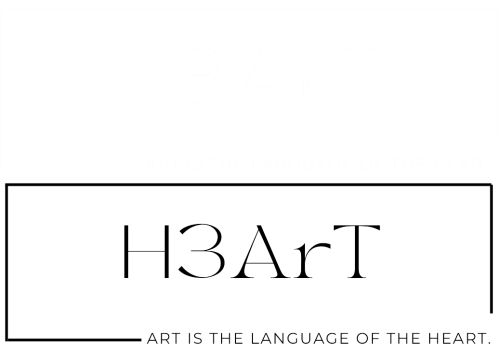

# H3ArT_Artwork-Sharing-Platform
  - ### Logo
    
  - ### Project Detail:
    - **Class:** SWP391-NET1706-SP2024
    - **Project Supervisor:** Nguyen Thi Cam - HuongNTC2
    - **Topic:** Artwork Sharing Platform (H3ArT)
    - **Authors:**
      - Nguyễn Hữu Minh Tài - SE170053
      - Nguyễn Tấn Hưng - QE170205
      - Đặng Công Hưng - SE171500
      - Phạm Lê Quý Anh - SE170529
    - **Project:** Artworks Sharing and Selling Platform - Social Media, E-Commerce hybrid - Consumer to Consumer
    - **Techs:** RestfulAPI - Ajax - SQL Sever - Bootstrap5 - JavaScript - HTML/CSS - .NET 8 with C#
    - **Technology:**
      - Stripe: Payment processing interface for secure transactions.
      - Facebook: Integration for social media authentication.
      - Google: Integration for authentication.
      - Disqus: Integration of commenting system on blogs or artworks.
      - Datatables: Integration for enhanced data presentation and manipulation.
      - Toastr: Integration for display notifications or alerts to users.
      - SweetAlerts2: Integration for showing custom alert messages/dialogs.
      - TinyMCE: Integration for a rich text editor.
    - **Structure:** Using ASP.NET Core MVC (.NET 8) Structure 
  - ### Main process report
    - **Link:** [Main Process](Document/MAIN_PROCESS_REPORT.xlsx)
  - ### The old repositories(Use in the coding process)
    - **Link:** [The old repositories](https://github.com/conghung2708/H3ArTArtwork_LanthuN)
